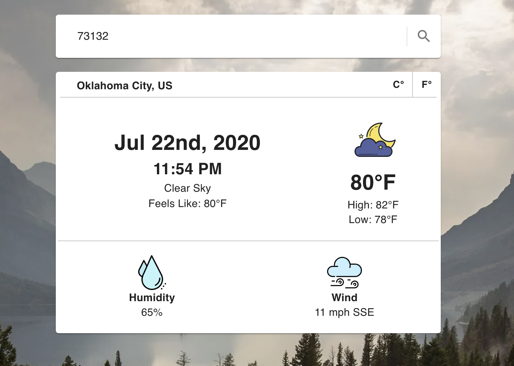

# Weather Forecast

Enter a location to get the current date, time, and weather. Add the abbreviated country code at the end of your search for more accurate results. (IE: Los Angeles, US)

> **Home page**

# 

## Table of contents

1. [Demo](#demo)
2. [Technologies](#technologies)
3. [Features](#features)
4. [Development](#development)

## Demo

Here is the working live demo:
[https://justinkar.github.io/weather-app/](https://justinkar.github.io/weather-app/).

## Technologies

- Javascript (ES6)
- ReactJS
- Material-UI
- MomentJS
- OpenWeatherMap API

## Features

- Toggle between Celsius and Fahrenheit
- Displays Local Date and Time
- Displays in-depth weather information

## Development

To set up this App locally, clone this repo to your desktop and run `npm install` to install all the dependencies. Then `npm start` to launch the App.
